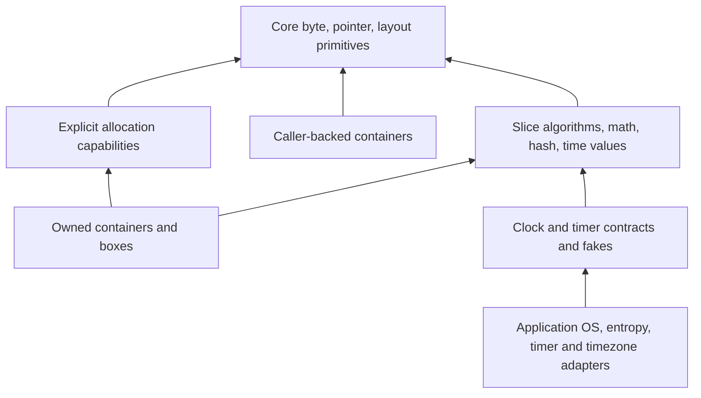

Dodo embeds its standard-library sources in the compiler. Imports work from any
directory and with a copied compiler binary; no registry or separate installation
is needed. Packages are loaded only when imported, including their explicit
dependencies. Core and allocation packages require no OS, global allocator,
scheduler, or garbage collector.

The library includes [collections](collections.md), [mathematics](math.md),
[hashing and checksums](hash.md), and [time values and clock contracts](time.md).
HTTP, JSON/TOML, filesystem, threading, and peripheral drivers are not implemented.
This branch builds on the committed core/alloc foundation. Its `std/text` and
`std/fmt` imports currently provide just the allocation-free decimal byte parser
and padded integer writer used by time; the broader I/O/text work is separate.

## Packages

| Import | Contents |
| --- | --- |
| `core/mem` | Size/alignment/field-offset queries, moving exchange, opaque uninitialized storage. |
| `core/ptr` | Checked-reference-to-raw-pointer conversions and unsafe memory operations. |
| `core/mmio` | Width-specific volatile device access. |
| `core/num` | Checked, saturating, and wrapping `usize` arithmetic; alignment calculations. |
| `core/bytes` | Byte comparisons, searching, copying, filling, reversing, endian reads/writes. |
| `core/slice` | Optional checked element and subslice access, preserving source borrows. |
| `core/ascii` | ASCII classification, case conversion, decimal and hexadecimal digit values. |
| `core/option` | Moving `take`, `replace`, and `unwrap_or` helpers. |
| `alloc/error` | Shared `AllocError` values. |
| `alloc/layout` | Validated size/alignment, padding, arrays, and field layout composition. |
| `alloc/block` | Move-only raw allocation descriptors. |
| `alloc/arena` | Fallible bump allocation from an exclusively borrowed byte slice. |
| `alloc/pool` | Fixed-block allocation and reuse from an exclusively borrowed byte slice. |
| `alloc/boxed` | Deterministic ownership of one allocated value. |
| `alloc/arena_box`, `alloc/pool_box` | Safe box constructors for each concrete allocator, imported independently. |
| `alloc/shared_arena`, `alloc/shared_box` | Caller-backed shared allocation capabilities and checked owning boxes. |
| `std/collections` | Slice algorithms and statically dispatched policies; child packages contain individual fixed and owned containers. |
| `std/math`, `std/math/trig` | Checked integers and portable binary64 functions; trigonometry and its table are independently imported. |
| `std/hash`, `std/checksum` | Incremental FNV-1a/SipHash, explicit key sources, CRC-32 and Adler-32. |
| `std/time` | Checked duration, timestamp, Gregorian date and time-of-day values. |
| `std/time/clock`, `std/time/timer`, `std/time/iso8601` | Clock/timer contracts, deterministic fakes, and UTC text conversion. |
| `std/text`, `std/fmt` | ASCII decimal parsing and caller-buffer padded integer formatting. |

`mem`, `ptr`, and `mmio` are compiler intrinsics; the remaining modules are Dodo
source libraries. Imported names use the final path component, for example
`bytes.read_u32_be`. See [packages and imports](packages.md) for namespace limits.

## Portable core utilities

`num.MAX` and `num.MIN` follow the selected target's pointer width. The functions
`checked_add`, `checked_sub`, `checked_mul`, `checked_div`, `checked_rem`,
`checked_shl`, and `checked_shr` return `Result<usize, ArithmeticError>`.
Errors distinguish overflow, division by zero, invalid shifts, and invalid
alignment. `checked_shl` rejects shifted-out bits as overflow. Saturating and
wrapping variants are provided for addition, subtraction, and multiplication.
`min`, `max`, `is_power_of_two`, and `align_up` complete the resource-arithmetic
helpers. This module currently covers `usize`, not every numeric type.

`bytes` operates on borrowed byte slices. `equal`, `compare`, `starts_with`,
`ends_with`, and `find` do not allocate. `compare` returns -1, 0, or 1 in
lexicographic order. `fill` and `reverse` mutate a slice in place. `copy_from`
requires equal lengths and returns a `BufferError.LengthMismatch` otherwise.

Endian functions are named `read_u16_le`, `write_u16_le`, and so on for 16-, 32-,
and 64-bit unsigned integers, with both `le` and `be` forms. They take a byte
offset, permit unaligned byte positions, and return `BufferError.OutOfBounds`
for invalid ranges, including overflowing offsets. Writes validate the entire
range before changing any byte. They work independently of CPU endianness.

`slice.get`, `get_mut`, `first`, and `last` return optional checked references;
`subslice` and `subslice_mut` return optional views using an exclusive end
index. Empty valid ranges succeed, reversed/out-of-bounds ranges return `none`.
Returned borrows cannot outlive or conflict with their source. `is_empty` works
with any element type.

`ascii` classifies bytes with `is_ascii`, `is_digit`, `is_hex_digit`,
`is_lowercase`, `is_uppercase`, `is_alphabetic`, `is_alphanumeric`,
`is_whitespace`, `is_control`, and `is_graphic`. Whitespace includes ASCII space
and bytes 9 through 13. Case conversion leaves non-ASCII bytes unchanged;
`digit_value` and `hex_value` return `Option<u8>`.

`option.take(&mut value)` leaves `none` and returns the old option;
`option.replace(&mut value, replacement)` installs `some(replacement)` and
returns the old option. They inherit `mem.replace`'s current restriction against
payloads containing checked borrows or Results. `unwrap_or` consumes both its
arguments and returns the payload or fallback; the unused value is destroyed.

## Opaque storage and moving values

`MaybeUninit<T>` is a move-only built-in storage type with the size and alignment
of `T`. It never automatically destroys a `T`, including when it is a struct
field or array element. Its bytes do not constitute a valid initialized value
until the unsafe caller establishes that invariant.

```dodo
package storage

import "core/mem"
import "core/ptr"

fn main() -> i32 {
    storage := mem.uninit::<i32>()
    pointer := mem.uninit_as_mut_ptr(&mut storage)
    unsafe { ptr.write(pointer, 42) }
    value := unsafe { mem.assume_init(storage) }
    return value - 42
}
```

`mem.init(value)` moves an initialized value into opaque storage. Dropping the
storage does not drop that value. `mem.assume_init(storage)` consumes storage
and restores ordinary ownership and destruction; it is unsafe because every
byte and invariant of `T` must be valid. `mem.uninit_as_ptr` and
`mem.uninit_as_mut_ptr` expose raw pointers without dereferencing them.

`mem.replace(&mut destination, replacement)` returns the old value without
destroying it and installs the replacement. `mem.swap(&mut a, &mut b)` exchanges
two disjoint initialized values without running destructors. Arguments are
evaluated before storage changes; a failed `?` in the replacement leaves the
original value intact.

`mem.offset_of::<Record>("field")` returns a direct struct field's ABI offset.
The field name must be a string literal and satisfy ordinary field visibility;
nested paths and runtime reflection are not supported.

Exchange currently rejects types containing checked borrows or Results because
their source dependencies and handling obligations cannot yet be transferred
through this interface. `mem.init` likewise cannot hide either in opaque
storage. Reading a checked-borrow-bearing `T` back from raw or opaque storage
is unsupported. These restrictions also apply transitively through aggregates.

See [memory and foreign calls](memory-and-ffi.md) for pointer signatures and
unsafe contracts. The compiler may lower memory operations to target toolchain
helpers such as `memcpy`, `memmove`, and `memset`. Freestanding programs must
supply those helpers when referenced, as well as their own startup/linker setup;
none of these helpers requires a heap or an OS.

## Allocation layouts and failures

`layout.Layout.new(size, align)` returns a validated layout. Alignment must be a
nonzero power of two, and size rounded up to alignment must fit in `isize` on
the selected target. Fields are private so safe code cannot violate this rule.
Zero-sized allocations are supported.

Methods include `size`, `align`, `clone`, `padding`, `pad_to_align`, `align_to`,
`repeat`, and `extend`. `extend` returns an `ExtendedLayout` with `offset()`
for the appended field and `layout()` for the combined layout. Use
`pad_to_align` before treating a composed record as an array element.
`layout.of::<T>()` and `layout.array::<T>(count)` use the target's ABI.
Arithmetic failures return an error without wrapping or trapping.

`AllocError` distinguishes `InvalidAlignment`, `SizeOverflow`, `Exhausted`,
and `UnsupportedLayout`. There is no implicit process termination on allocation
failure and no global allocator fallback.

## Arenas, pools, and raw blocks

`arena.Arena.new(&mut bytes)` retains an exclusive borrow of caller-owned
storage. `allocate(&layout)` returns `Block!AllocError`; `allocate_zeroed`
also zeroes every requested byte. Alignment is calculated from the actual
backing address, so an unaligned subslice works. Failed requests leave the arena
unchanged. `capacity`, `used`, and `remaining` report byte counts including
consumed alignment padding.

Arena deallocation consumes the descriptor but reclaims no individual space.
`reset` reclaims everything. Both operations are unsafe: destroy stored values
first and stop using all pointers affected by the operation.

`pool.Pool.new(&mut bytes, block_size, block_align)` builds a fixed-block free
list in the unused storage. Blocks are padded to hold an aligned `usize` link;
`block_size()` and `block_align()` report the effective size/alignment.
Allocation and deallocation take constant time. `capacity()` and `available()`
count blocks, not bytes. Oversized or over-aligned requests return
`UnsupportedLayout`; a depleted free list returns `Exhausted`. Deallocation
reuses a block, and unsafe `reset` invalidates every outstanding allocation.

Zero-sized allocations consume no arena bytes or pool blocks. Their pointers
are nonnull and aligned but may dangle; they must not be accessed as nonzero
storage. Raw `Block` descriptors do not keep an allocator alive and do not free
or destroy anything when dropped. Their pointer access is unsafe. Deallocation
must use the exact originating allocator, with a live descriptor, at most once.
`Block.from_raw_parts` is unsafe and requires a valid, exclusive raw allocation
matching its layout.

## Owning a value

`arena_box.new` and `pool_box.new` allocate and initialize one value. Their
adapter packages depend on the generic `alloc/boxed` package; using arena boxes
does not import the pool implementation.
The resulting `Box<T, A>` holds an exclusive checked borrow of its allocator,
keeping the allocator and its backing storage live until the box is destroyed
or consumed. This initial API permits one live box per borrowed allocator.

```dodo
package ownership

import "alloc/arena"
import "alloc/arena_box"

fn main() -> i32 {
    storage := [0u8; 64]
    allocator := arena.Arena.new(&mut storage)
    match arena_box.new(&mut allocator, 42i32) {
        ok(value) => { return value.into_inner() - 42 },
        err(_) => { return 1 },
    }
}
```

Save as `ownership.dodo` and run `dodo run ownership.dodo`; success exits with
status zero and prints nothing. Dropping a box destroys its value exactly once,
then deallocates the block. `into_inner` moves the value out and still releases
the allocation. `replace(value)` installs a new value and returns the old one
without destroying it. Allocation failure destroys the supplied value exactly once.
Arena space is only reclaimed on reset; pool blocks are immediately reusable.

`get` and `get_mut` expose checked `&T`/`&mut T` views; live views prevent
conflicting access, replacement, extraction, and destruction of their box.
`as_ptr` and `as_mut_ptr` expose raw access. `T` cannot contain checked borrows or
Results, including through nested aggregates; a box cannot hide an error that
the program must handle.
The generic `boxed.new::<T, A>` entry point is unsafe: a custom allocator must
honor the documented allocation validity, exclusivity, lifetime, and
deallocation contracts. Concrete arena/pool constructors establish those
contracts for the caller. There are no traits, vtables, or implicit allocation.

## Sharing an explicit allocator

`shared_arena.SharedArena.new(&mut bytes)` reserves an aligned `usize` cursor
inside caller memory. Construction fails with `Exhausted` if that metadata does
not fit. `capacity`, `used`, and `remaining` exclude this reserved prefix; used
space includes allocation alignment padding. The arena never exposes the
metadata as a checked reference. Its shared operations access it through private
raw pointers, without casting any shared reference to an exclusive reference.
There are no callbacks during allocation and no concurrent access guarantee.

`handle()` produces an owned capability that retains a shared loan of the arena
and all its backing dependencies. Different handles can supply allocations to
unrelated containers or boxes concurrently in one thread. Mutating a container
borrows its own storage exclusively and retains the allocator's shared dependency.
It does not upgrade that dependency to an exclusive allocator loan.

`Handle.allocate(&layout)` uses O(1) bump allocation; failure leaves its cursor
unchanged. Zero-sized allocation consumes no additional space. Unsafe
`Handle.deallocate(block)` consumes the unique descriptor without reclaiming
space. Unsafe `SharedArena.reset(&mut self)` reclaims all allocations and requires
that every initialized value be destroyed and every raw pointer invalidated.
The exclusive receiver statically prevents reset while checked handles remain
live. `Handle.clone` is a checked reborrow of that handle; obtaining separate
handles directly from the arena avoids tying their lifetimes to each other.

`shared_box.new(arena.handle(), value)` is a safe constructor with checked
`get`, `get_mut`, moving `replace`/`into_inner`, and deterministic destruction.
Each `std/collections/shared_*` adapter uses the same capability. The original
arena/pool Box interfaces retain their exclusive borrowing behavior.

## Dependency boundaries



No portable package requests entropy, obtains the current time, waits, starts a
runtime, or installs a global allocator. Hashing never imports collections; time
values never import clocks. Generic customization is monomorphized ordinary
method dispatch. [Package-specific documentation](collections.md) gives storage,
complexity, ordering, invalidation, and numerical contracts.

## Verification

`cargo test --locked --all-targets` includes native execution at `-O0` and `-O3`,
allocation failure and reuse, drop order, and rejection of invalid lifetimes,
unsafe calls, aliases, and Result handling. Portable fixtures also emit
WebAssembly and Cortex-M0 objects; object generation does not test board startup
or actual hardware execution.

Windows tests cross-compile the same core/alloc/std fixtures to x64 PE executables
and run them in Wine at both optimization levels:

```sh
cargo build --locked --bin dodo
python3 scripts/test_stdlib_windows.py
python3 scripts/test_portable_stdlib.py
```

The script requires Clang, `lld-link`, Wine, and a MinGW `libkernel32.a` import
library (or `--kernel32 PATH`). Fedora also needs the matching `wine-common`
data package; Wine's first-run setup needs its metadata files. The script uses
a temporary Wine prefix, forwards each
fixture's exit status through a minimal Windows startup, and supplies compiler
memory helpers and LLVM's stack probe without linking a Windows C runtime or
allocator. The probe is exercised by the large-allocation failure fixture. This tests
Dodo-generated Windows programs, not a Windows build of the Rust compiler.
`--wine PATH --wineserver PATH` selects a matching local Wine installation,
including an unpacked installation with its complete data directory; no system
installation change is required. Both scripts accept `--fixture` for a focused
run and `--report PATH` for machine-readable validation records. The portable
object runner checks all fixtures at O0 and O3 for WebAssembly and Cortex-M0.
