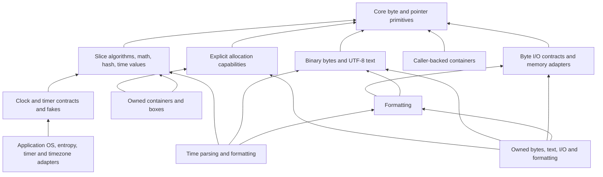

Dodo embeds its standard-library sources in the compiler. Imports work from any
directory and with a copied compiler binary; no registry or separate installation
is needed. Packages are loaded only when imported, including their explicit
dependencies. Portable foundation packages require no OS, libc, global allocator,
scheduler, or garbage collector. Hosted packages select explicit platform adapters.

The library includes byte I/O, formatting, binary buffers, UTF-8 text,
[collections](collections.md), [mathematics](math.md), [hashing and
checksums](hash.md), and [time values and clock contracts](time.md).
Hosted [filesystem](filesystem.md), [process](processes.md),
[environment](environment.md), [thread](threads.md), and
[synchronization](synchronization.md) packages build on those foundations.
HTTP, JSON/TOML, and peripheral drivers are not implemented.

## Packages

| Import | Contents |
| --- | --- |
| `core/mem` | Size/alignment/field-offset queries, moving exchange, opaque uninitialized storage. |
| `core/ptr` | Checked-reference-to-raw-pointer conversions and unsafe memory operations. |
| `core/mmio` | Width-specific volatile device access. |
| `core/num` | Checked, saturating, and wrapping `usize` arithmetic; alignment calculations. |
| `core/bytes` | Byte comparisons, searching, copying, filling, reversing, endian reads/writes. |
| `core/slice` | Optional checked element and subslice access, preserving source borrows. |
| `core/ascii` | ASCII classification, case conversion, decimal and hexadecimal digit values. |
| `core/option` | Moving `take`, `replace`, and `unwrap_or` helpers. |
| `alloc/error` | Shared `AllocError` values. |
| `alloc/layout` | Validated size/alignment, padding, arrays, and field layout composition. |
| `alloc/block` | Move-only raw allocation descriptors. |
| `alloc/arena` | Fallible bump allocation from an exclusively borrowed byte slice. |
| `alloc/pool` | Fixed-block allocation and reuse from an exclusively borrowed byte slice. |
| `alloc/boxed` | Deterministic ownership of one allocated value. |
| `alloc/arena_box`, `alloc/pool_box` | Safe box constructors for each concrete allocator, imported independently. |
| `alloc/shared_arena`, `alloc/shared_box` | Caller-backed shared allocation capabilities and checked owning boxes. |
| `std/collections` | Slice algorithms and statically dispatched policies; child packages contain individual fixed and owned containers. |
| `std/math`, `std/math/trig` | Checked integers and portable binary64 functions; trigonometry and its table are independently imported. |
| `std/hash`, `std/checksum` | Incremental FNV-1a/SipHash, explicit key sources, CRC-32 and Adler-32. |
| `std/time` | Checked duration, timestamp, Gregorian date and time-of-day values. |
| `std/time/clock`, `std/time/timer`, `std/time/iso8601` | Clock/timer contracts, deterministic fakes, and UTC text conversion. |
| `std/io` | Structural blocking/polling byte I/O, memory adapters, buffering, bounded transfer helpers. |
| `std/fmt` | Byte-sink formatting, static customization, integer and exact-precision floating conversion. |
| `std/bytes` | Checked byte views, bounded binary readers/writers, endian operations and searching. |
| `std/text` | UTF-8 views, scalar decoding/encoding/iteration, fixed builders and numeric parsing. |
| `std/text_unicode` | Optional Unicode 16.0.0 whitespace classification and trimming. |
| `std/bytes_alloc` | Explicitly allocated, move-only growing byte buffers. |
| `std/arena_bytes`, `std/pool_bytes` | Independently imported safe buffer constructors. |
| `std/io_alloc` | Allocated append writers and bounded read-to-buffer helpers. |
| `std/text_alloc`, `std/fmt_alloc` | Allocated UTF-8 strings and formatting into a newly owned string. |
| `std/fs`, `std/fs/types`, `std/fs/path` | Native files/directories, portable metadata contracts, and lexical paths. |
| `std/process`, `std/process/alloc` | Direct child execution, streams, waiting, termination, and bounded output collection. |
| `std/env` | Native arguments, environment snapshots, child-environment construction, and current-directory access. |
| `std/thread` | Move tasks, joins, explicit allocated detach, and checked transfer contracts. |
| `std/sync`, `std/sync/allocated` | Caller-backed and explicitly allocated locks, guards, conditions, Once, barriers, and channels. |
| `std/sync/atomic` | Integer atomics with explicit ordering, independent of OS blocking facilities. |

See [hosted platform adapters](platform.md) for target support, native errors,
resource ownership, C toolchain requirements, and custom object linking.

`mem`, `ptr`, and `mmio` are compiler intrinsics; library APIs use Dodo source,
with small C boundaries for complex hosted interfaces.
Imports use their final path component by default. Explicit
aliases distinguish packages with the same name:

```dodo
import "std/bytes"
import "core/bytes" as raw
```

`bytes.Reader` and `raw.read_u32_be` then refer to their respective packages.
Aliases are local to the importing package; transitive imports retain their
own identities. See [packages and imports](packages.md).

## Portable core utilities

`num.MAX` and `num.MIN` follow the selected target's pointer width. The functions
`checked_add`, `checked_sub`, `checked_mul`, `checked_div`, `checked_rem`,
`checked_shl`, and `checked_shr` return `Result<usize, ArithmeticError>`.
Errors distinguish overflow, division by zero, invalid shifts, and invalid
alignment. `checked_shl` rejects shifted-out bits as overflow. Saturating and
wrapping variants are provided for addition, subtraction, and multiplication.
`min`, `max`, `is_power_of_two`, and `align_up` complete the resource-arithmetic
helpers. This module currently covers `usize`, not every numeric type.

`bytes` operates on borrowed byte slices. `equal`, `compare`, `starts_with`,
`ends_with`, and `find` do not allocate. `compare` returns -1, 0, or 1 in
lexicographic order. `fill` and `reverse` mutate a slice in place. `copy_from`
requires equal lengths and returns a `BufferError.LengthMismatch` otherwise.

Endian functions are named `read_u16_le`, `write_u16_le`, and so on for 16-, 32-,
and 64-bit unsigned integers, with both `le` and `be` forms. They take a byte
offset, permit unaligned byte positions, and return `BufferError.OutOfBounds`
for invalid ranges, including overflowing offsets. Writes validate the entire
range before changing any byte. They work independently of CPU endianness.

`slice.get`, `get_mut`, `first`, and `last` return optional checked references;
`subslice` and `subslice_mut` return optional views using an exclusive end
index. Empty valid ranges succeed, reversed/out-of-bounds ranges return `none`.
Returned borrows cannot outlive or conflict with their source. `is_empty` works
with any element type.

`ascii` classifies bytes with `is_ascii`, `is_digit`, `is_hex_digit`,
`is_lowercase`, `is_uppercase`, `is_alphabetic`, `is_alphanumeric`,
`is_whitespace`, `is_control`, and `is_graphic`. Whitespace includes ASCII space
and bytes 9 through 13. Case conversion leaves non-ASCII bytes unchanged;
`digit_value` and `hex_value` return `Option<u8>`.

`option.take(&mut value)` leaves `none` and returns the old option;
`option.replace(&mut value, replacement)` installs `some(replacement)` and
returns the old option. They inherit `mem.replace`'s current restriction against
payloads containing checked borrows or Results. `unwrap_or` consumes both its
arguments and returns the payload or fallback; the unused value is destroyed.

## Opaque storage and moving values

`MaybeUninit<T>` is a move-only built-in storage type with the size and alignment
of `T`. It never automatically destroys a `T`, including when it is a struct
field or array element. Its bytes do not constitute a valid initialized value
until the unsafe caller establishes that invariant.

```dodo
package storage

import "core/mem"
import "core/ptr"

fn main() -> i32 {
    storage := mem.uninit::<i32>()
    pointer := mem.uninit_as_mut_ptr(&mut storage)
    unsafe { ptr.write(pointer, 42) }
    value := unsafe { mem.assume_init(storage) }
    return value - 42
}
```

`mem.init(value)` moves an initialized value into opaque storage. Dropping the
storage does not drop that value. `mem.assume_init(storage)` consumes storage
and restores ordinary ownership and destruction; it is unsafe because every
byte and invariant of `T` must be valid. `mem.uninit_as_ptr` and
`mem.uninit_as_mut_ptr` expose raw pointers without dereferencing them.

`mem.replace(&mut destination, replacement)` returns the old value without
destroying it and installs the replacement. `mem.swap(&mut a, &mut b)` exchanges
two disjoint initialized values without running destructors. Arguments are
evaluated before storage changes; a failed `?` in the replacement leaves the
original value intact.

`mem.offset_of::<Record>("field")` returns a direct struct field's ABI offset.
The field name must be a string literal and satisfy ordinary field visibility;
nested paths and runtime reflection are not supported.

Exchange currently rejects types containing checked borrows or Results because
their source dependencies and handling obligations cannot yet be transferred
through this interface. `mem.init` likewise cannot hide either in opaque
storage. Reading a checked-borrow-bearing `T` back from raw or opaque storage
is unsupported. These restrictions also apply transitively through aggregates.

See [memory and foreign calls](memory-and-ffi.md) for pointer signatures and
unsafe contracts. The compiler may lower memory operations to target toolchain
helpers such as `memcpy`, `memmove`, and `memset`. Freestanding programs must
supply those helpers when referenced, as well as their own startup/linker setup;
none of these helpers requires a heap or an OS.

## Allocation layouts and failures

`layout.Layout.new(size, align)` returns a validated layout. Alignment must be a
nonzero power of two, and size rounded up to alignment must fit in `isize` on
the selected target. Fields are private so safe code cannot violate this rule.
Zero-sized allocations are supported.

Methods include `size`, `align`, `clone`, `padding`, `pad_to_align`, `align_to`,
`repeat`, and `extend`. `extend` returns an `ExtendedLayout` with `offset()`
for the appended field and `layout()` for the combined layout. Use
`pad_to_align` before treating a composed record as an array element.
`layout.of::<T>()` and `layout.array::<T>(count)` use the target's ABI.
Arithmetic failures return an error without wrapping or trapping.

`AllocError` distinguishes `InvalidAlignment`, `SizeOverflow`, `Exhausted`,
and `UnsupportedLayout`. There is no implicit process termination on allocation
failure and no global allocator fallback.

## Arenas, pools, and raw blocks

`arena.Arena.new(&mut bytes)` retains an exclusive borrow of caller-owned
storage. `allocate(&layout)` returns `Block!AllocError`; `allocate_zeroed`
also zeroes every requested byte. Alignment is calculated from the actual
backing address, so an unaligned subslice works. Failed requests leave the arena
unchanged. `capacity`, `used`, and `remaining` report byte counts including
consumed alignment padding.

Arena deallocation consumes the descriptor but reclaims no individual space.
`reset` reclaims everything. Both operations are unsafe: destroy stored values
first and stop using all pointers affected by the operation.

`pool.Pool.new(&mut bytes, block_size, block_align)` builds a fixed-block free
list in the unused storage. Blocks are padded to hold an aligned `usize` link;
`block_size()` and `block_align()` report the effective size/alignment.
Allocation and deallocation take constant time. `capacity()` and `available()`
count blocks, not bytes. Oversized or over-aligned requests return
`UnsupportedLayout`; a depleted free list returns `Exhausted`. Deallocation
reuses a block, and unsafe `reset` invalidates every outstanding allocation.

Zero-sized allocations consume no arena bytes or pool blocks. Their pointers
are nonnull and aligned but may dangle; they must not be accessed as nonzero
storage. Raw `Block` descriptors do not keep an allocator alive and do not free
or destroy anything when dropped. Their pointer access is unsafe. Deallocation
must use the exact originating allocator, with a live descriptor, at most once.
`Block.from_raw_parts` is unsafe and requires a valid, exclusive raw allocation
matching its layout.

## Owning a value

`arena_box.new` and `pool_box.new` allocate and initialize one value. Their
adapter packages depend on the generic `alloc/boxed` package; using arena boxes
does not import the pool implementation.
The resulting `Box<T, A>` holds an exclusive checked borrow of its allocator,
keeping the allocator and its backing storage live until the box is destroyed
or consumed. This initial API permits one live box per borrowed allocator.

```dodo
package ownership

import "alloc/arena"
import "alloc/arena_box"

fn main() -> i32 {
    storage := [0u8; 64]
    allocator := arena.Arena.new(&mut storage)
    match arena_box.new(&mut allocator, 42i32) {
        ok(value) => { return value.into_inner() - 42 },
        err(_) => { return 1 },
    }
}
```

Save as `ownership.dodo` and run `dodo run ownership.dodo`; success exits with
status zero and prints nothing. Dropping a box destroys its value exactly once,
then deallocates the block. `into_inner` moves the value out and still releases
the allocation. `replace(value)` installs a new value and returns the old one
without destroying it. Allocation failure destroys the supplied value exactly once.
Arena space is only reclaimed on reset; pool blocks are immediately reusable.

`as_ptr` and `as_mut_ptr` expose raw access. `as_ref` / `as_mut` and
`get` / `get_mut` are equivalent checked `&T` / `&mut T` accessors, retained
for compatibility. A live view prevents conflicting access, replacement,
extraction, moving or destroying the box, and releasing its allocation.
`T` cannot contain checked borrows or
Results, including through nested aggregates; a box cannot hide an error that
the program must handle.
The generic `boxed.new::<T, A>` entry point is unsafe: a custom allocator must
honor the documented allocation validity, exclusivity, lifetime, and
deallocation contracts. Concrete arena/pool constructors establish those
contracts for the caller. There are no traits, vtables, or implicit allocation.

## Binary bytes and growing buffers

`std/bytes` imports `core/bytes` under an explicit alias. It operates on ordinary
checked byte slices and never allocates. `check_range(length, offset, count)`
uses subtraction before addition, so overflowing and reversed extents produce
`RangeError.OutOfBounds`. `view` and `view_mut` return source-dependent checked
slices. Valid zero-length views include the end of the input. `find` and `rfind`
search byte subsequences (an empty needle matches the start/end respectively);
`find_byte`, `equal`, `compare`, `starts_with`, and `ends_with` reuse core helpers.
No operation interprets UTF-8 or requires aligned storage.

`Reader.new(data)` has `position`, `remaining`, `rest`, checked absolute `seek`,
`skip`, `take(count)`, `read_u8`, and `read_u16_le`/`read_u16_be` through 32/64-bit
variants. `take` returns a checked borrowed view and advances only on success.
`Writer.new(storage)` exposes `position`, `remaining`, `written`, `seek`, `put`,
`write_u8`, and matching endian methods. Operations validate the complete range
before changing data or position. `written()` is the prefix ending at the
current cursor, including after a seek; it is not a high-water mark. `std/bytes`
also provides offset-based endian free functions with the same names. Fixed
writers never grow or allocate. See `examples/bytes.dodo`.

`std/bytes_alloc.Buffer<A>` is imported separately. Safe constructors
`arena_bytes.new(&mut arena, capacity, limit)` and
`pool_bytes.new(&mut pool, capacity, limit)` use the existing allocation layouts
and allocator contracts. Both capacities are explicit byte counts. The maximum
must fit `alloc/layout.max_size()` and initial capacity must not exceed it.
The buffer starts with length zero. A zero maximum supports empty operations;
appending a byte returns `AllocError.Exhausted`.

`len`, `capacity`, `limit`, `as_slice`, and `as_mut_slice` expose initialized
storage. `reserve(additional)` reserves beyond the current length; `extend` and
`push` append bytes. They return `void!AllocError` and preserve data, length, and
capacity on failure. Growth doubles capacity, clamps it to the specified limit,
and temporarily requires both old and new allocations to be live. No global
allocator or fallback is consulted. Arena growth consumes additional arena space
because individual deallocation does not reclaim it; pools must have another
suitable free block. `truncate(length)` clamps to the existing length and
`clear()` empties the logical contents; neither zeroes storage nor shrinks it.

The buffer owns its block and exclusively borrows its allocator. Destruction
releases the current block exactly once. Each successful growth releases the
old block. `as_slice`/`as_mut_slice` retain a checked borrow of the buffer; a
subsequent use of a view prevents growth, mutation, moving, or destruction in
between. Raw pointers are invalidated by growth, movement of their actual
storage, or destruction. Safe code cannot append a view of the same buffer to
itself. Moving a buffer transfers ownership and its allocator dependency; it
does not clone the allocation. The unsafe generic `bytes_alloc.new` constructor
requires an allocator honoring the documented unique-storage and deallocation
contracts. Its methods must be public for static dispatch.

## Portable byte I/O (`std/io`)

`std/io` imports only `core/bytes`, `core/num`, and `core/mem`. It operates on bytes and checked
borrowed slices, with no OS, libc, heap, locale, scheduler, global initialization,
or device discovery. Files, sockets, UARTs, and other platform adapters implement
the same small method contracts in independently imported packages. This package
provides memory implementations; it does not open files or configure hardware.

| Contract | Required public method |
| --- | --- |
| Blocking reader | `read(&mut self, destination: &mut[u8]) -> usize!io.Error` |
| Blocking writer | `write(&mut self, source: &[u8]) -> usize!io.Error` |
| Polling reader | `poll_read(&mut self, destination: &mut[u8]) -> io.Poll!io.Error` |
| Polling writer | `poll_write(&mut self, source: &[u8]) -> io.Poll!io.Error` |
| Optional absolute seek | `seek(&mut self, position: usize) -> usize!io.Error` |

These are structural contracts checked when generic helpers are instantiated.
Dodo monomorphizes calls to the concrete public methods; no trait objects,
reflection, closures, or scheduler are required. An adapter type exposing public
methods must itself be public. See `examples/io.dodo`
for memory-to-memory copying through caller scratch space.

A successful primitive operation returns its processed prefix length. A reader
may initialize only that prefix; a writer accepts only that prefix. Counts must
never exceed the supplied slice length. A nonempty successful read returning zero
means EOF. A nonempty successful write returning zero becomes `WriteZero` in
completion helpers. Empty requests succeed with zero and helpers never invoke the
underlying device. `MemoryWriter` and `Cursor` report `BufferFull` when full.

An `io.Error` contains `kind`, `transferred`, and an adapter-defined `code: i32`.
`transferred` records prefix progress even when the same operation fails. The
portable `io.failure(kind, transferred)` constructor sets `code` to zero. Error
kinds are `UnexpectedEof`, `WriteZero`, `Interrupted`, `BufferFull`, `OutOfBounds`,
`InvalidInput`, `InvalidProgress`, and `Other`. A provider is responsible for
classifying recoverable device errors and preserving useful platform codes.
Helpers validate returned counts before forming their next checked subslice;
`InvalidProgress` means the provider violated its contract. This validation does
not repair an unsafe provider that already wrote outside its supplied slice.

`read_once` and `write_once` perform at most one call. `read_up_to` fills the
provided destination or successfully returns a shorter prefix at EOF.
`read_exact` returns `UnexpectedEof` for a short input. `write_all` accepts the
entire source or returns an error. Completion helpers retry `Interrupted` after
accounting for any prefix already processed; a persistent interruption can block
indefinitely. They return total progress for the entire helper invocation,
preserving a terminal device error and code even if its prefix finished the
requested byte count. None rolls back bytes already read or written.

`MemoryReader.new(&bytes)` retains a shared borrow and exposes `position`,
`remaining`, `read`, `poll_read`, and absolute `seek`. `MemoryWriter.new(&mut
bytes)` retains an exclusive borrow and exposes `position`, remaining capacity,
`written`, `write`, and `poll_write`. `Cursor.new(&mut bytes)` reads and overwrites
initialized fixed-size storage, with `bytes`, `position`, and `seek`. It never
grows. Seeking permits positions from zero through the end, returns the new
position, and leaves the old position unchanged on failure. Generic `io.seek`
requires only the optional seek method; read/write helpers never require it.

`LimitReader.new(&mut reader, limit)` yields a synthetic EOF after consuming at
most `limit` bytes, including progress reported with errors. `remaining` reports
its unused budget. `skip(&mut reader, count, &mut scratch)` discards exactly
`count` bytes or returns `UnexpectedEof` with total consumed progress. Empty
scratch is an `InvalidInput` unless the requested count is zero.

`copy(&mut reader, &mut writer, &mut scratch, limit)` copies at most `limit` bytes.
`CopyReport` contains `read`, `written`, and `eof`; `eof` is false when the limit
was reached without an additional read. A nonzero limit requires nonempty
scratch. A `CopyError` keeps total `read`, total `written`, and the terminal
`cause`. Thus `read - written` tells the caller how many bytes were consumed but
not delivered. Progress from a failed read is offered to the writer before the
read error is returned. If that write also fails, the write error takes
precedence. Scratch retains the most recently read chunk, including its unwritten
suffix. The explicit limit bounds every count and prevents count overflow; pass
`core/num.MAX` when that target-sized limit is suitable.

`BufferedReader.new(&mut reader, &mut storage)` and
`BufferedWriter.new(&mut writer, &mut storage)` reject empty storage and retain
exclusive checked borrows of both arguments. The reader exposes its current
`buffered()` view, drains read-ahead before fetching more, and preserves an error
that arrived with data until its final buffered byte is delivered. Dropping a
buffered reader discards unread read-ahead, so callers must consume it before
resuming directly from the underlying reader when every byte matters.

The writer exposes `pending()` and `capacity()`. Writes accept source bytes into
caller storage and flush when that storage becomes full and another write needs
space. `flush()` returns physical device progress and preserves the unwritten
suffix after failure so it can be retried. A write that fails while flushing old
bytes reports zero accepted bytes from its current input. There is deliberately
no I/O in destruction: dropping a writer discards pending bytes. Call `flush`
and handle its `Result` explicitly before releasing the device. Neither adapter
implicitly calls an optional platform flush operation such as a disk sync.

`Poll` contains `transferred` and `PollState.Ready`, `Pending`, or `Eof`. Pending
may accompany positive progress. Callers consume that prefix and decide when to
retry. `poll_read_once` and `poll_write_once` issue exactly one attempt and never
spin, wait, register a waker, or allocate. For a nonempty read, ready with zero
progress is invalid; EOF is explicit. For a nonempty write, ready with zero
progress is `WriteZero`, and EOF is invalid. Empty polling requests return ready
with zero progress without touching the provider. Interrupted polling errors are
returned directly rather than retried. Blocking and polling methods are separate
capabilities; neither is implicitly converted into the other.

## Allocation-dependent I/O (`std/io_alloc`)

`io_alloc.BufferWriter<A>.new(&mut bytes_alloc.Buffer<A>)` appends to an explicitly
allocated, capacity-limited buffer. The adapter holds an exclusive checked borrow
of the buffer; its allocator and backing storage remain live. Each `write` either
appends the entire source or returns `BufferFull` with zero progress and leaves
existing contents unchanged. Error codes preserve the `AllocError` category:
1 = `InvalidAlignment`, 2 = `SizeOverflow`, 3 = `Exhausted`, and
4 = `UnsupportedLayout`. No global allocator is consulted.

`io_alloc.append_from(&mut reader, &mut buffer, &mut scratch, limit)` combines
this append writer with bounded `io.copy`. Earlier successful chunks stay owned
by the buffer if a later read or allocation fails; `CopyError` preserves consumed
and appended counts. Both the transfer limit and the buffer's independent growth
limit apply. Construct buffers using `std/arena_bytes`, `std/pool_bytes`, or the
unsafe custom-allocator constructor in `std/bytes_alloc`; merely importing
`std/io` does not import any allocation package.

Checked views returned by memory or buffered adapters borrow the adapter, so it
cannot be mutated, moved, or destroyed while that view is still in use. Growing a
buffer likewise requires ending its outstanding views. Destruction releases
borrow dependencies deterministically and never hides a pending `Result`.


## Byte formatting

`std/fmt` writes to any `std/io` writer using ordinary generic methods. Create
`fmt.Formatter.new::<WriterType>(&mut writer)`, then call `string`,
`padded_string`, `boolean`, `codepoint`, `unsigned`, `signed`, or `floating`.
Every method returns `void!io.Error`. `written()` counts bytes emitted by that
formatter. Failure includes all prior successful output and the failing write's
partial progress in `Error.transferred`; bytes already written remain visible.
An empty string succeeds without calling the sink. Formatting never flushes.
A `MemoryWriter` supplies caller-provided fixed storage; it reports `BufferFull`
with the accepted prefix when exhausted.

`fmt.defaults()` creates options with decimal radix, no minimum width, ASCII
space fill, right alignment, minus signs only, lowercase digits, and no zero
padding. Public options select radix 2 through 36, uppercase digits, minimum
width, `Alignment.Left`/`Right`/`Center`, and `Sign.NegativeOnly`/`Always`/`Space`.
Center alignment places an odd extra padding byte on the right. Numeric
`zero_pad` emits the sign first, then zeroes, then digits; it takes precedence
over alignment. Width measures **bytes**, not Unicode scalars, grapheme clusters,
or terminal columns. `fill` must be ASCII. Padding never truncates content.
Integer functions support the complete `u64`/`i64` range, including `i64`'s
minimum; smaller types can be explicitly widened. Radix prefixes are explicit
strings supplied by the caller. Code points must be Unicode scalar values and
are encoded using `std/text`; invalid scalar values fail before output.

`floating(value, precision, style, &options)` formats binary64 with mandatory
precision from 0 through 324. `FloatStyle.Fixed` uses that many digits after the
decimal point. `Scientific` uses one leading digit, the specified fraction, and
an exponent with a sign and at least two digits. Rounding is nearest, ties to
even, including subnormal values and cases that carry into the next exponent.
Precision zero omits the decimal point. Negative zero remains negative.
Infinity prints `inf`/`-inf`; NaN payloads and NaN signs are canonicalized to
`nan`. The uppercase option changes those spellings and the exponent marker.
A positive-sign option also applies to NaN and infinity. Binary32 values can be
exactly widened to binary64; formatting then rounds that exact value. There is
no shortest-roundtrip, `%g`, hexadecimal-float, locale, or dynamic format-string
API in this release.

Floating conversion adapts the exact base-1e9 expansion from musl 1.2.5's
[`fmt_fp`](https://git.musl-libc.org/cgit/musl/tree/src/stdio/vfprintf.c?h=v1.2.5),
with integer guard/sticky rounding. Its MIT copyright and permission notice is
preserved in `stdlib/std/LICENSE.musl`. No C code or libc is linked. The helper
uses 128 `u32` limbs, 1100 decimal scratch bytes, and a 640-byte output buffer,
plus ordinary scalar locals and call frames; integer and string formatting do
not use this floating scratch. The algorithm favors correctness and bounded
storage over shortest-output speed. All target memory and soft-float helper
requirements are those of the normal compiler backend.

Customization is static and explicit. A public value type defines
`pub fn format<W>(&self, output: &mut fmt.Formatter<W>) -> void!io.Error`;
`fmt.value(&mut sink, &value)` specializes that method and returns the written
byte count. The method may compose all standard formatting operations and
propagate failures with `?`. It requires no traits, closures, reflection,
vtables, scheduler, or allocation. See `examples/formatting.dodo`.

`write_u32_padded(destination, value, width)` is an allocation-free convenience
for decimal output into a caller-owned byte slice, built on the same formatter
and memory-writer contracts. It writes at least `width` digits, adding leading
zeroes without truncating the value, and returns the written byte count. It
leaves the complete destination unchanged if it returns
`FormatError.BufferTooSmall`, and preserves all bytes beyond successful output.
No NUL terminator is added. [Time formatting](time.md#parsing-and-formatting)
uses this helper for fixed-width calendar fields.

`std/fmt_alloc` is imported independently. `fmt_alloc.string(buffer, &value)`
consumes a `std/bytes_alloc.Buffer`, clears its old contents, formats with the
buffer's explicit allocator and growth limit, and returns a validated
`text_alloc.String`. Use safe `arena_bytes`/`pool_bytes` constructors for the
buffer. `Error` distinguishes allocation, formatting, and UTF-8 validation;
custom formatters emitting malformed byte sequences cannot construct an invalid
string. Failure releases owned buffer storage deterministically. Formatter
errors preserve the byte count before failure, even though that failed buffer
is then destroyed. `fmt_alloc.allocate` also accepts a custom allocator, initial
capacity, and limit directly; it is unsafe because a generic allocator must
honor the allocation contract. Existing-sink formatting never imports these
allocation adapters.


## Portable text and owned UTF-8

`std/text` imports `core/ascii`, `core/bytes`, and `core/mem`; it allocates
nothing and requires no locale, OS, allocator, scheduler, or initialization.
`std/text_alloc` is an independent import for explicitly allocated strings. Its
buffer obtains storage through the caller's allocator, with an explicit maximum
capacity and recoverable allocation errors.

### Bytes, scalars, and graphemes

A byte is an octet. A Unicode scalar is a code point in U+0000..U+10FFFF,
excluding U+D800..U+DFFF. A grapheme cluster can contain several scalars: for
example, a letter and a combining accent. `Text.len_bytes()` counts bytes;
`Text.len_scalars()` counts scalars. Neither measures displayed characters,
terminal columns, or grapheme clusters.

The scalar and UTF-8 definitions follow Unicode **16.0.0**. Validation requires
no Unicode tables. This package deliberately provides ASCII trimming and exact
UTF-8 searching; it does not silently apply normalization, locale-sensitive
matching, Unicode whitespace, case folding, or grapheme segmentation. The
independent `std/text_unicode` import adds the Unicode 16.0.0 White_Space
property and trimming; see the supplement below. Larger property tables and
advanced algorithms such as normalization or grapheme segmentation are not
implemented.

### Validation, decoding, and encoding

- `validate(bytes) -> void!Error` rejects overlong encodings, isolated continuation
  bytes, invalid leads, surrogates, values above U+10FFFF, and truncated input.
- `decode(bytes, offset) -> Decoded!Error` decodes one scalar and returns public
  `scalar` and `next` fields. `offset >= bytes.len` is `OutOfBounds`; EOF is
  represented by the iterator's `none`, not a made-up scalar.
- `decode_replacement(bytes, offset) -> Option<Decoded>` explicitly replaces
  each malformed **byte** with U+FFFD and advances by one. A following valid
  sequence is still decoded normally. At or past EOF it returns `none`. This
  policy is deterministic, but is not Unicode maximal-subpart replacement.
- `is_scalar(value)` checks scalar validity. `encoded_len(scalar)` and
  `encode(scalar, destination)` return one through four bytes. Invalid scalars
  and insufficient capacity leave the destination completely unchanged.

`Error` contains public `kind: ErrorKind` and `position: usize`. Positions are
byte offsets, except that an invalid scalar's position is zero and an invalid
scalar-index lookup reports that index. Invalid continuation and scalar-range
restrictions report the offending byte; truncation reports `bytes.len`, where
a required byte is missing. `BufferFull` reports the available destination
length for encoding, or the builder's used length for append. Strict operations
never silently replace invalid input.

### Borrowed text

`Text.new(bytes) -> Text!Error from(bytes)` validates a checked immutable byte
slice. `Text.from_str(value)` takes a language string without revalidation.
`as_bytes()` and `as_str()` expose shared views retaining the original storage
dependency. The private data field prevents safe code from inventing unvalidated
text. Mutating or destroying the source while a view is subsequently used is a
compile-time error.

`slice(start, end)` uses exclusive byte endpoints and rejects reversed,
out-of-bounds, or non-scalar-boundary ranges. Empty ranges at valid boundaries
succeed. `is_boundary`, `floor_boundary`, and `ceil_boundary` make byte alignment
explicit; the rounding methods reject positions past the end. `byte_offset`
maps a scalar index to a byte boundary, including one-past-the-end;
`slice_scalars` slices by scalar indices. These operations do not split scalars,
but can split a grapheme cluster. Scalar indexing is linear in the byte length.

`scalars()` returns a stateful `Scalars`; `next()` returns `Option<Scalar>` with
public `value`, `start`, and `end` fields. Repeated calls after EOF return `none`.
No closures, traits, or scheduler are required.

`equal`, `starts_with`, `ends_with`, and `find` take another validated `Text`.
Comparison is exact byte comparison; `find` returns a byte offset, and an empty
needle matches at zero. `trim_ascii` removes ASCII space and bytes 9 through 13
at both ends. `split(delimiter)` rejects empty delimiters and returns a `Split`
whose `next()` preserves leading, adjacent, and trailing empty fields. Both
source and delimiter remain borrowed. Each returned field borrows the splitter,
so finish using it before advancing the splitter again.

### Fixed and allocated builders

`Builder.new(&mut storage)` retains an exclusive checked borrow of caller-owned
bytes. It starts empty, and `capacity()` never changes. `append(&Text)` and
`push(scalar)` validate capacity before writing; failure leaves length and
contents unchanged. `clear()` changes the logical length to zero; it does not
zero old bytes. `as_text()` exposes the initialized prefix. A live view prevents
mutating, moving, or dropping the builder until its last use.

`text_alloc.String<A>.new(buffer)` takes ownership of a
`bytes_alloc.Buffer<A>`, validates its initialized contents, and releases the
buffer on validation failure. Its operations are `len_bytes`, `capacity`,
`limit`, `as_text`, `reserve(additional)`, `append(&Text)`, `append_str(&str)`,
`push(scalar)`, `truncate(byte_length)`, and `clear`. Truncation rejects lengths
past the current end and positions inside a scalar. Append and reservation
errors preserve existing contents. `push` returns `text_alloc.Error`, which
separates scalar errors from allocator errors; allocation-only methods return
`alloc/error.AllocError` directly.

Construct a buffer with the independently imported `std/arena_bytes` or
`std/pool_bytes` adapters, supplying initial capacity and a maximum. The string
owns the buffer and keeps its allocator exclusively borrowed. Growth can move
storage and temporarily needs both allocations alive; arena deallocation does
not reclaim individual old blocks. Shared text views prevent growth at compile
time until their last use. Raw pointers become invalid when storage moves.
Dropping the string releases its allocation exactly once; there is no hidden
global allocator fallback.

### Explicit numeric parsing

`parse_u64(bytes, radix)` and `parse_i64(bytes, radix)` consume the entire input.
Radices 2 through 36 accept ASCII digits and case-insensitive ASCII letters.
An optional leading `+` is supported; only the signed parser accepts `-`.
Whitespace, prefixes such as `0x`, digit separators, and trailing characters
are rejected. `InvalidRadix`, `EmptyNumber`, `InvalidDigit`, and `Overflow` are
recoverable errors. Overflow identifies the first digit that cannot fit.
Both signed boundaries, including -9223372036854775808, are handled exactly.

`parse_u32_decimal(bytes)` is a strict decimal helper for fixed-width protocol
and calendar fields. It consumes the entire input, accepts only ASCII `0`–`9`,
and rejects signs, whitespace, and separators. Its `ParseError` distinguishes
`Empty`, `InvalidDigit`, and `Overflow`; leading zeroes are permitted. It reuses
the integer parser with the `u32` range limit. The [time parser](time.md#parsing-and-formatting)
uses it after validating field positions and punctuation.

`parse_f64(bytes)` accepts finite decimal syntax:
`[+-]?(digits(.digits?)?|.digits)([eE][+-]?digits)?`.
It rejects whitespace, hexadecimal notation, NaN, infinity, separators, and
partial input. Decimal overflow is `Overflow`; underflow rounds to a subnormal
or signed zero. Negative zero is preserved. Conversion rounds the exact decimal
rational to binary64 using round-to-nearest, ties-to-even, including subnormal
values and halfway cases. This is a portable Dodo fixed-big-integer algorithm;
it does not call libc, depend on the floating-point locale, or accumulate an
approximate decimal significand in a float.

`MAX_FLOAT_DIGITS` is **768**: all mantissa digits, including leading and trailing
zeros, count. A longer mantissa returns `TooManyDigits` at the first excess
byte. Exponent text can be arbitrarily long; its magnitude is internally
saturated only after classification becomes unambiguous. Conversion uses fixed
4096-bit integer arrays on the stack and can require several kilobytes of stack
space. This favors simple, auditable correctness over specialized fast-path
performance. It is suitable for freestanding builds, but small embedded stacks
must budget for the parser. There is currently no direct `f32`, grapheme,
normalization, Unicode case conversion, or arbitrary-precision numeric API.

### Verification

`tests/stdlib/std_text.dodo` and `std_text_alloc.dodo` execute at `-O0` and `-O3`
and compile to WebAssembly and Cortex-M0 objects. They exercise scalar limits,
malformed UTF-8 byte positions, replacement policy, encoding exhaustion, text
boundaries/splitting, transactional builder failure, integer extremes, precise
floating-point ties/subnormals, growing allocations, failure preservation, and
allocation cleanup. `tests/std_text.rs` also generates 263 decimal/reference
comparisons (including values near subnormal and finite limits), executes them
at both optimization levels, and rejects nine invalid borrow/Result programs.


### Optional Unicode whitespace supplement

`std/text_unicode` is independently imported; `std/text` does not depend on it.
`UNICODE_VERSION` is `"16.0.0"`. `is_whitespace(scalar)` implements all 25
scalars in the `White_Space` property from the primary
[Unicode 16.0.0 PropList](https://www.unicode.org/Public/16.0.0/ucd/PropList.txt).
Invalid scalars return false. The data is distributed under Unicode License V3,
with the full copyright and permission notice in `stdlib/std/LICENSE.unicode`.

`trim(input: &text.Text) -> text.Text from(input)` removes Unicode whitespace
scalars at both ends, keeps interior bytes exactly, and preserves the source
borrow. Empty or entirely whitespace input produces an empty view. It scans
the input once using fixed stack space, allocates nothing, and cannot fail for
validated `Text`. Unlike ASCII trimming, this includes U+0085, U+00A0, U+1680,
U+2000..U+200A, U+2028, U+2029, U+202F, U+205F, and U+3000. U+180E, U+200B, and
U+FEFF are not stripped. This property does not promise grapheme boundaries,
normalization, locale behavior, or display-width handling.

`tests/stdlib/std_text_unicode.dodo` checks the property over all Unicode code
points, tests all 25 whitespace values, and exercises trimming with multibyte
scalars and combining marks. It executes at `-O0`/`-O3` and emits WebAssembly
and Cortex-M0 objects. Additional rejection cases ensure trimmed views cannot
escape source storage or survive invalidating mutation.

## Sharing an explicit allocator

`shared_arena.SharedArena.new(&mut bytes)` reserves an aligned `usize` cursor
inside caller memory. Construction fails with `Exhausted` if that metadata does
not fit. `capacity`, `used`, and `remaining` exclude this reserved prefix; used
space includes allocation alignment padding. The arena never exposes the
metadata as a checked reference. Its shared operations access it through private
raw pointers, without casting any shared reference to an exclusive reference.
There are no callbacks during allocation and no concurrent access guarantee.

`handle()` produces an owned capability that retains a shared loan of the arena
and all its backing dependencies. Different handles can supply allocations to
unrelated containers or boxes concurrently in one thread. Mutating a container
borrows its own storage exclusively and retains the allocator's shared dependency.
It does not upgrade that dependency to an exclusive allocator loan.

`Handle.allocate(&layout)` uses O(1) bump allocation; failure leaves its cursor
unchanged. Zero-sized allocation consumes no additional space. Unsafe
`Handle.deallocate(block)` consumes the unique descriptor without reclaiming
space. Unsafe `SharedArena.reset(&mut self)` reclaims all allocations and requires
that every initialized value be destroyed and every raw pointer invalidated.
The exclusive receiver statically prevents reset while checked handles remain
live. `Handle.clone` is a checked reborrow of that handle; obtaining separate
handles directly from the arena avoids tying their lifetimes to each other.

`shared_box.new(arena.handle(), value)` is a safe constructor with checked
`get`, `get_mut`, moving `replace`/`into_inner`, and deterministic destruction.
Each `std/collections/shared_*` adapter uses the same capability. The original
arena/pool Box interfaces retain their exclusive borrowing behavior.

## Dependency boundaries



No portable package requests entropy, obtains the current time, waits, starts a
runtime, or installs a global allocator. Hashing never imports collections; time
values never import clocks. Generic customization is monomorphized ordinary
method dispatch. The sections above and the [collections](collections.md),
[math](math.md), [hash](hash.md), and [time](time.md) pages specify storage,
complexity, ordering, invalidation, and numerical contracts.

## Verification

`cargo test --locked --all-targets` includes native execution at `-O0` and `-O3`,
allocation failure and reuse, drop order, and rejection of invalid lifetimes,
unsafe calls, aliases, and Result handling. Portable fixtures also emit
WebAssembly and Cortex-M0 objects; object generation does not test board startup
or actual hardware execution.

Windows tests cross-compile the same core/alloc/std fixtures to x64 PE executables
and run them in Wine at both optimization levels:

```sh
cargo build --locked --bin dodo
python3 scripts/test_stdlib_windows.py
python3 scripts/test_portable_stdlib.py
```

The script requires Clang, `lld-link`, Wine, and a MinGW `libkernel32.a` import
library (or `--kernel32 PATH`). Fedora also needs the matching `wine-common`
data package; Wine's first-run setup needs its metadata files. The script uses
a temporary Wine prefix, forwards each
fixture's exit status through a minimal Windows startup, and supplies compiler
memory helpers and LLVM's stack probe without linking a Windows C runtime or
allocator. The probe is exercised by the large-allocation failure fixture. This tests
Dodo-generated Windows programs, not a Windows build of the Rust compiler.
`--wine PATH --wineserver PATH` selects a matching local Wine installation,
including an unpacked installation with its complete data directory; no system
installation change is required. Both scripts accept `--fixture` for a focused
run and `--report PATH` for machine-readable validation records. The portable
object runner checks all fixtures at O0 and O3 for WebAssembly and Cortex-M0.
