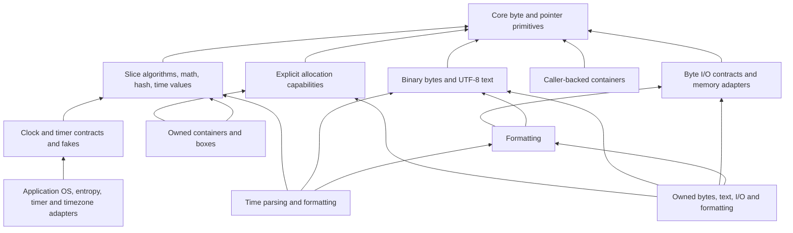

Dodo embeds its standard-library sources in the compiler. Imports work from any
directory with no registry or separate library installation. Start with one of
the tasks below; each guide includes a complete program, its run command,
expected output, and common failure handling before the detailed contracts.
These guides follow the current source checkout. The library belongs to your
compiler binary: if an older binary reports an unknown package or method,
[build the matching source revision](building-from-source.md).

## Choose a task

| Task | Recommended starting API | Guide |
| --- | --- | --- |
| Print a value | `console.println` and `console.printf` | [Formatting and console output](formatting.md) |
| Read a file | `fs.read_file` with `platform.workspace()` | [Filesystem](filesystem.md) |
| Get an environment variable | `env.get` with `env.Workspace.new()` | [Environment](environment.md) |
| Run a command | `process.Command.new` and `output` | [Processes](processes.md) |
| Build a string | `text.Builder.new` with a byte array | [Text](text.md) |
| Store values | `fixed_vector.Vector.new` with `Option<T>` slots | [Collections](collections.md) |
| Read the current time | `time/hosted.WallClock.new().wall_now()` | [Time and clocks](time.md) |
| Fetch a URL | `http/hosted.Client.new` and `get` | [HTTP](http.md), [hosted HTTP/HTTPS](hosted-http.md) |
| Serve a route | `web/app.Server` with named handler structs | [Web applications](web.md) |

Use a fresh directory for each copied example and run the commands there.
A marked `dodo test` example also runs through
`dodo test docs --doc` in this repository. Peer/file examples use the local setup
shown in their guides; none requires a public Internet service.

## Imports, storage, and failures

Import only the packages you use. The last path component becomes its name:
`import "std/text"` exposes `text.Builder`. Alias duplicate names explicitly,
for example `import "std/http/hosted" as client`. Imports are not re-exports;
application code must import the types and helpers it names. See [packages](packages.md).

Start with fixed arrays and the recommended workspace/constructor in each guide.
They keep capacity visible and need no global heap. Choose shared-arena owned
containers when growth or several independent owners are needed; use raw/generic
allocator constructors only when implementing a custom allocator. The library
never silently selects an allocator on exhaustion.

Results must be handled. Examples use `match` at `main` and propagate with `?`
inside helpers. A nonzero exit status denotes failure; the text beside each
example explains the codes. For user-facing diagnostics use
`console.stderr().println` with a formatted error; `std/fmt/errors` supplies
optional adapters for enum errors. Check I/O prefix counts before retrying.
[Patterns and Results](patterns-and-results.md) explains the syntax.

## Portable and hosted functionality

Portable core, allocation, bytes, text, collections, math, hashes, time values,
DNS/TLS contracts, HTTP/1.1 protocol engines and web routing require no OS,
libc, global allocator, scheduler or garbage collector. Portable fixture checks
emit `wasm32-unknown-unknown` and `thumbv6m-none-eabi` objects at O0 and O3.
This is code-generation evidence, not tested board startup or hardware execution.
Freestanding links supply startup, memory helpers and any soft-float support.

Hosted console, filesystem, environment, processes, clocks, threads,
synchronization, sockets, TLS backends and HTTP/web wrappers support **x86-64
Linux GNU and Windows x64 MSVC/GNU**. They reject Linux x32/musl, AArch64 Linux,
macOS and other unsupported ABIs. Atomic operations have a separate
[x86-64/AArch64 target contract](synchronization.md#atomics).
Hosted linking needs a target C toolchain and headers; OpenSSL-backed TLS also
needs OpenSSL 3.5 or newer. See [platform adapters](platform.md) and [TLS](tls.md).
OS/C-library calls may allocate internally even when Dodo storage is fixed.

HTTP/1.1 clients, servers, streaming framing, and web routing **are implemented**.
HTTP/2, HTTP/3/QUIC, WebSockets, JSON/TOML serialization and general peripheral
drivers are remaining work. MMIO primitives alone do not configure a device.
[Compiler limits](implementation.md) and [container element restrictions](container-elements.md)
remain relevant: check them when using references or Results as stored elements.

## Packages

Every application-facing family has a guide. Child packages are separate imports;
importing a parent does not import all its children.

| Family and guide | Imports | Availability |
| --- | --- | --- |
| [Core utilities](core.md) | `core/mem`, `core/ptr`, `core/mmio`, `core/ascii`, `core/bytes`, `core/num`, `core/option`, `core/slice` | Portable. |
| [Allocation and boxes](allocation.md) | `alloc/arena`, `alloc/arena_box`, `alloc/block`, `alloc/boxed`, `alloc/error`, `alloc/layout`, `alloc/pool`, `alloc/pool_box`, `alloc/shared_arena`, `alloc/shared_box` | Portable. |
| [Binary bytes](bytes.md) | `std/arena_bytes`, `std/bytes`, `std/bytes_alloc`, `std/pool_bytes` | Portable. |
| [Byte I/O](io.md) | `std/io`, `std/io_alloc` | Portable. |
| [Console I/O](console.md) | `std/console` | Hosted. |
| [Formatting](formatting.md) | `std/fmt`, `std/fmt/errors`, `std/fmt_alloc` | Portable. |
| [UTF-8 text](text.md) | `std/text`, `std/text_alloc`, `std/text_shared` | Portable. |
| [Collections](collections.md) | `std/collections`, `std/collections/deque`, `std/collections/fixed_deque`, `std/collections/fixed_map`, `std/collections/fixed_set`, `std/collections/fixed_vector`, `std/collections/hash_map`, `std/collections/hash_set`, `std/collections/heap`, `std/collections/ordered_map`, `std/collections/ordered_set`, `std/collections/shared_deque`, `std/collections/shared_hash_map`, `std/collections/shared_hash_set`, `std/collections/shared_heap`, `std/collections/shared_ordered_map`, `std/collections/shared_ordered_set`, `std/collections/shared_vector`, `std/collections/vector` | Portable. |
| [Mathematics](math.md) | `std/math`, `std/math/trig` | Portable. |
| [Hashing and checksums](hash.md) | `std/checksum`, `std/hash` | Portable. |
| [Time and clocks](time.md) | `std/time`, `std/time/clock`, `std/time/hosted`, `std/time/iso8601`, `std/time/timer` | Values/contracts portable; hosted clock explicit. |
| [Native strings and errors](platform.md) | `std/platform`, `std/platform/error` | Hosted. |
| [Filesystem and lexical paths](filesystem.md) | `std/fs`, `std/fs/path`, `std/fs/types`, `std/fs/unix`, `std/fs/windows_ext` | Paths/types portable; files hosted. |
| [Environment](environment.md) | `std/env` | Hosted. |
| [Processes](processes.md) | `std/process`, `std/process/alloc` | Hosted. |
| [Threads](threads.md) | `std/thread` | Hosted. |
| [Synchronization](synchronization.md) | `std/sync`, `std/sync/allocated`, `std/sync/atomic`, `std/sync/error` | Blocking/allocated hosted; atomic target-specific. |
| [Networking and DNS](networking.md) | `std/net`, `std/net/dns`, `std/net/operations` | Values/DNS/operations portable; native sockets hosted. |
| [TLS](tls.md) | `std/tls`, `std/tls/openssl`, `std/tls/stream` | Contracts/stream portable; OpenSSL hosted. |
| [HTTP](http.md), [hosted HTTP/HTTPS](hosted-http.md) | `std/http`, `std/http/client`, `std/http/connection`, `std/http/hosted`, `std/http/https`, `std/http/server` | Protocol/polling portable; hosted/HTTPS explicit. |
| [Web serving](web.md) | `std/web`, `std/web/application`, `std/web/app`, `std/web/hosted`, `std/web/https`, `std/web/reactor`, `std/web/response`, `std/web/server`, `std/web/static_files`, `std/web/stream`, `std/web/testing` | Routing/registration/composition portable; app/hosted/HTTPS/reactor/static files explicit. |

## Implementation and adapter packages

Prefer the application APIs above. The following imports exist to implement or
select providers; they are not additional recommended starting paths.

| Imports | Role and entry point |
| --- | --- |
| `std/env/linux` | Target-specific provider machinery; use the corresponding [hosted facade](platform.md). |
| `std/env/windows` | Target-specific provider machinery; use the corresponding [hosted facade](platform.md). |
| `std/float_decimal` | Internal decimal conversion; use [formatting](formatting.md) or [text parsing](text.md). |
| `std/fs/linux` | Target-specific provider machinery; use the corresponding [hosted facade](platform.md). |
| `std/fs/windows` | Target-specific provider machinery; use the corresponding [hosted facade](platform.md). |
| `std/http/hosting` | Shared hosted driving/error support; use [HTTP](http.md) or [web serving](web.md). Import this only when naming its shared Error type or building a provider. |
| `std/net/linux` | Selected socket adapter; use [networking](networking.md). |
| `std/net/windows` | Selected socket adapter; use [networking](networking.md). |
| `std/platform/linux` | Target-specific provider machinery; use the corresponding [hosted facade](platform.md). |
| `std/platform/windows` | Target-specific provider machinery; use the corresponding [hosted facade](platform.md). |
| `std/process/linux` | Target-specific provider machinery; use the corresponding [hosted facade](platform.md). |
| `std/process/windows` | Target-specific provider machinery; use the corresponding [hosted facade](platform.md). |
| `std/sync/linux` | Target-specific provider machinery; use the corresponding [hosted facade](platform.md). |
| `std/sync/windows` | Target-specific provider machinery; use the corresponding [hosted facade](platform.md). |
| `std/thread/linux` | Target-specific provider machinery; use the corresponding [hosted facade](platform.md). |
| `std/thread/native` | Target-specific provider machinery; use the corresponding [hosted facade](platform.md). |
| `std/thread/windows` | Target-specific provider machinery; use the corresponding [hosted facade](platform.md). |
| `std/time/linux` | Native clock boundary; use [hosted clocks](time.md). |
| `std/time/windows` | Native clock boundary; use [hosted clocks](time.md). |
| `std/tls/linux` | Native OpenSSL boundary; use [TLS](tls.md). |
| `std/tls/windows` | Native OpenSSL boundary; use [TLS](tls.md). |
| `std/web/linux` | Native rooted-file boundary; use [static files](web.md#optional-static-files). |
| `std/web/windows` | Native rooted-file boundary; use [static files](web.md#optional-static-files). |

Virtual imports `std/platform/native`, `std/fs/native`, `std/env/native`,
`std/process/native`, `std/thread/native`, `std/sync/native`, `std/net/native`,
`std/time/native`, `std/tls/native`, and `std/web/native` select compatible
providers. `std/platform/native` exposes advanced native values;
`std/net/native` is also the public socket entry point. Explicit `linux`/`windows`
imports are for matching-target integrations. `runtime.c` files are embedded
implementation boundaries, not Dodo imports.

`alloc/error` and `alloc/layout` are public supporting types. `alloc/block` and
the unsafe generic constructors in `alloc/boxed`, `std/bytes_alloc`, and owned
collection modules are allocator-author building blocks; use the linked safe
concrete constructors first. `core/mem`, `core/ptr` and `core/mmio` are compiler
intrinsics, not source packages.

The sections below retain older overview anchors and point to the relocated
contracts.

## Portable core utilities

See the [core guide](core.md) for a runnable quickstart and the full contracts.

## Opaque storage and moving values

See the [core guide](core.md) for a runnable quickstart and the full contracts.

## Allocation layouts and failures

See the [allocation guide](allocation.md) for a runnable quickstart and the full contracts.

## Arenas, pools, and raw blocks

See the [allocation guide](allocation.md) for a runnable quickstart and the full contracts.

## Owning a value

See the [allocation guide](allocation.md) for a runnable quickstart and the full contracts.

## Binary bytes and growing buffers

See the [bytes guide](bytes.md) for a runnable quickstart and the full contracts.

## Portable byte I/O (`std/io`)

See the [io guide](io.md) for a runnable quickstart and the full contracts.

## Allocation-dependent I/O (`std/io_alloc`)

See the [io guide](io.md) for a runnable quickstart and the full contracts.

## Byte formatting

See the [formatting guide](formatting.md) for a runnable quickstart and the full contracts.

## Portable text and owned UTF-8

See the [text guide](text.md) for a runnable quickstart and the full contracts.

<span id="bytes-scalars-and-graphemes"></span>
<span id="validation-decoding-and-encoding"></span>
<span id="borrowed-text"></span>
<span id="fixed-and-allocated-builders"></span>
<span id="explicit-numeric-parsing"></span>

The [text guide](text.md) retains these text and UTF-8 contracts.

## Sharing an explicit allocator

See the [allocation guide](allocation.md) for a runnable quickstart and the full contracts.

## Dependency boundaries

Networking preserves three independent boundaries: portable addresses, DNS/HTTP
protocol engines and routing; selected transport, TLS, time and execution
providers; and clients/servers that compose them. See [networking](networking.md),
[TLS](tls.md), [HTTP](http.md), and [web applications](web.md). Importing `std/http`
or `std/web` requires no sockets, TLS, filesystem, allocator or scheduler.



No portable package requests entropy, obtains the current time, waits, starts a
runtime, or installs a global allocator. Hashing never imports collections; time
values never import clocks. Generic customization is monomorphized ordinary
method dispatch. The linked module guides and the [collections](collections.md),
[math](math.md), [hash](hash.md), and [time](time.md) pages specify storage,
complexity, ordering, invalidation, and numerical contracts.

## Verification

`cargo test --locked --all-targets` includes native execution at `-O0` and `-O3`,
allocation failure and reuse, drop order, and rejection of invalid lifetimes,
unsafe calls, aliases, and Result handling. Portable fixtures also emit
WebAssembly and Cortex-M0 objects; object generation does not test board startup
or actual hardware execution.

Windows tests cross-compile the same core/alloc/std fixtures to x64 PE executables
and run them in Wine at both optimization levels:

```sh
cargo build --locked --bin dodo
python3 scripts/test_stdlib_windows.py
python3 scripts/test_portable_stdlib.py
```

The script requires Clang, `lld-link`, Wine, and a MinGW `libkernel32.a` import
library (or `--kernel32 PATH`). Fedora also needs the matching `wine-common`
data package; Wine's first-run setup needs its metadata files. The script uses
a temporary Wine prefix, forwards each
fixture's exit status through a minimal Windows startup, and supplies compiler
memory helpers and LLVM's stack probe without linking a Windows C runtime or
allocator. The probe is exercised by the large-allocation failure fixture. This tests
Dodo-generated Windows programs, not a Windows build of the Rust compiler.
`--wine PATH --wineserver PATH` selects a matching local Wine installation,
including an unpacked installation with its complete data directory; no system
installation change is required. Both scripts accept `--fixture` for a focused
run and `--report PATH` for machine-readable validation records. The portable
object runner checks all fixtures at O0 and O3 for WebAssembly and Cortex-M0.

## Hosted conveniences

Hosted applications can use UTF-8 strings and bounded reusable workspace owners:

- [Filesystem](filesystem.md): `File.open_utf8`, `read_file`, and `write_file`.
- [Environment and arguments](environment.md): `env.get` and `Arguments.capture`.
- [Processes](processes.md): `CommandStorage`, `Command.arg`, and bounded `Command.output`.
- [Native clocks](time.md#native-providers-and-elapsed-measurements): hosted monotonic and wall clocks.
- [Console](console.md): borrowed standard streams, printing, and bounded line input.

[Platform storage and complete examples](platform.md#complete-hosted-examples-and-storage)
document capacities, retained output, defaults, timeout scope, and target differences.
Portable packages remain usable independently; native byte and UTF-16 APIs remain available.
